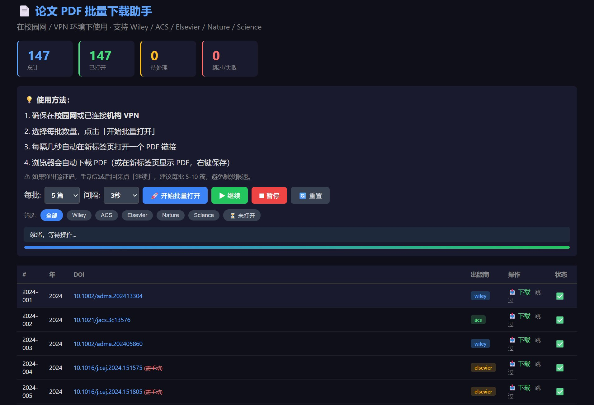

# 📄 Academic Paper PDF Batch Downloader / 学术论文 PDF 批量下载工具

<p align="center">
  
</p>

>  A lightweight, browser-based batch download assistant for academic papers. Generates a local HTML page with direct PDF links for all major publishers (Wiley, ACS, Elsevier, Nature, Science). Designed for researchers who need to build literature datasets from DOI lists.
>
>  轻量级、基于浏览器的学术论文批量下载助手。根据 DOI 列表自动生成包含 PDF 直链的本地 HTML 页面，支持 Wiley、ACS、Elsevier、Nature、Science 等主要出版商。专为从文献列表构建数据集的研究者设计。

---

## ✨ Features / 功能特点

| Feature | Description |
|---------|-------------|
| **DOI → PDF URL Mapping** | Automatically constructs direct PDF download URLs from DOIs based on publisher-specific URL patterns (Wiley `pdfdirect/`, ACS `doi/pdf/`, etc.) |
| **Zero Automation Detection** | Runs entirely in *your* real browser — no Selenium, Playwright, or headless browsers. Cloudflare/Turnstile cannot detect it. |
| **Batch Control** | Configurable batch size (3/5/10/20) and interval (1.5s–5s) to balance speed and rate-limit avoidance |
| **Progress Persistence** | Download state saved in `localStorage` — refresh or close the page, your progress is preserved |
| **Publisher Filtering** | Filter papers by publisher to process one source at a time |
| **Institutional Auth Compatible** | Uses your existing browser session, so campus network / VPN / proxy authentication works seamlessly |

| 功能 | 说明 |
|------|------|
| **DOI → PDF URL 映射** | 根据 DOI 前缀自动识别出版商，构造直接的 PDF 下载链接（Wiley 用 `pdfdirect/`，ACS 用 `doi/pdf/` 等） |
| **零自动化检测** | 完全在你的真实浏览器中运行——不使用 Selenium、Playwright 或无头浏览器，Cloudflare/Turnstile 无法检测 |
| **批量控制** | 可配置每批数量（3/5/10/20篇）和间隔时间（1.5s–5s），在速度和限速之间取得平衡 |
| **进度持久化** | 下载状态保存在 `localStorage` 中——刷新或关闭页面后进度不丢失 |
| **出版商筛选** | 按出版商筛选论文，逐个来源处理 |
| **兼容机构认证** | 使用浏览器已有的会话，校园网 / VPN / 代理认证无缝生效 |

---

## 🏗 Architecture / 技术架构

```
checklist_2024_2026.txt          generate_download_page.py          Browser (Chrome)
┌─────────────────────┐         ┌──────────────────────────┐       ┌─────────────────────┐
│  DOI list (147 DOIs)│────────▶│  Parse DOIs              │       │  Your real browser   │
│  - 2024: 68 papers  │         │  Detect publishers       │       │  with institutional  │
│  - 2025: 73 papers  │         │  Construct PDF URLs      │──────▶│  auth / VPN / proxy  │
│  - 2026: 6 papers   │         │  Generate HTML + JS      │       │                      │
└─────────────────────┘         └──────────────────────────┘       │  Batch open PDF tabs │
                                                                    │  Auto-download PDFs  │
                                                                    └─────────────┬───────┘
                                                                                  │
                                                                    ┌─────────────▼───────┐
                                                                    │  downloaded_pdfs/    │
                                                                    │  ├─ 2024_001_xxx.pdf│
                                                                    │  ├─ 2024_002_xxx.pdf│
                                                                    │  └─ ...              │
                                                                    └─────────────────────┘
```

---

## 🚀 Quick Start / 快速开始

### Prerequisites / 前提条件

- Python 3.8+
- A web browser (Chrome recommended / 推荐 Chrome)
- Institutional network access or VPN / 校园网或 VPN

### Installation & Usage / 安装与使用

```bash
# 1. Clone the repository / 克隆仓库
git clone https://github.com/GaryCao-45/paper-pdf-downloader.git
cd paper-pdf-downloader

# 2. Prepare your DOI list / 准备 DOI 列表
#    Edit checklist_2024_2026.txt or create your own (see format below)
#    编辑 checklist_2024_2026.txt 或按格式创建自己的列表

# 3. Generate the download page / 生成下载页面
python generate_download_page.py

# 4. The HTML page opens automatically in your browser
#    HTML 页面会自动在浏览器中打开
#    If not, manually open: downloaded_pdfs/download_helper.html
#    如未自动打开，手动打开: downloaded_pdfs/download_helper.html
```

### DOI List Format / DOI 列表格式

```
【2024年】（68 篇）
--------------------------------------------------
    1. https://doi.org/10.1002/adma.202413304
    2. https://doi.org/10.1021/jacs.3c13576
    3. https://doi.org/10.1016/j.cej.2024.151575
    ...

【2025年】（73 篇）
--------------------------------------------------
    1. https://doi.org/10.1002/adma.202508126
    ...
```

The parser extracts DOIs using regex, so the format is flexible — any line matching `<number>. https://doi.org/...` will be captured.

解析器使用正则提取 DOI，格式较灵活——只要行内匹配 `<编号>. https://doi.org/...` 即可被捕获。

---

## 📖 Usage Guide / 使用指南

<p align="center">
  <video src="https://github.com/user-attachments/assets/534a3a27-2254-4490-bc8d-cf863638937f" width="700" controls>
    Your browser does not support the video tag.
  </video>
</p>

> 🎬 **Demo video**: Batch downloading 147 perovskite solar cell papers in action.
>
> 🎬 **演示视频**：批量下载 147 篇钙钛矿太阳能电池论文的实际操作。

### Step-by-step / 操作步骤

1. **Connect to campus network or VPN** / 连接校园网或 VPN
2. **Open the generated HTML** in Chrome / 在 Chrome 中打开生成的 HTML
3. **Allow pop-ups** if prompted (click the icon in the address bar) / 如果提示拦截弹窗，点击地址栏图标允许
4. **Select batch size and interval**, then click "🚀 开始批量打开" / 选择批量大小和间隔，点击开始
5. **PDFs will open in new tabs** and auto-download (or display for manual save) / PDF 在新标签页打开并自动下载
6. **Pause anytime** with the stop button; resume when ready / 随时暂停，准备好后继续

### Tips / 使用技巧

- **Recommended batch size**: 5 papers with 3s interval to avoid rate limiting / 推荐每批 5 篇、间隔 3 秒
- **Use publisher filter**: Process all Wiley papers first, then ACS, etc. / 使用出版商筛选，先处理 Wiley，再处理 ACS
- **Elsevier / Nature papers**: These open the DOI page (no direct PDF URL construction possible) — click the PDF button manually / Elsevier 和 Nature 的论文会打开 DOI 页面，需手动点击 PDF 按钮
- **If blocked**: Pause, complete any CAPTCHA, then resume / 如果被拦截，暂停后完成验证再继续

---

## 🔬 Technical Background / 技术原理

### Why this approach? / 为什么选择这个方案？

We evaluated multiple automation strategies before arriving at the current browser-based approach:

在最终确定当前方案之前，我们评估了多种自动化策略：

| Approach / 方案 | Result / 结果 | Reason / 原因 |
|:---|:---|:---|
| **Playwright** (headed mode) | ❌ Cloudflare infinite loop / 无限验证循环 | CDP (Chrome DevTools Protocol) pipe detected by Turnstile |
| **Playwright** (persistent context) | ❌ Crash / 崩溃 | Windows DPAPI encryption prevents Cookie portability across data dirs |
| **undetected-chromedriver** | ❌ Network error / 网络错误 | ChromeDriver download from Google blocked in certain networks |
| **Direct HTTP** (requests/httpx) | ❌ 403 Forbidden | No institutional authentication in raw HTTP requests |
| **Browser-based HTML** ✅ | ✅ Works perfectly / 完美运行 | Real browser = real auth + no automation fingerprint |

### Key insight / 核心洞察

> The user's *own browser* is the best download tool — it already has institutional authentication, a clean automation fingerprint, and passes all bot detection. Instead of fighting anti-automation systems, we generate a helper page that works *with* the browser.

> 用户**自己的浏览器**就是最好的下载工具——它已经有机构认证、干净的自动化指纹，并能通过所有机器人检测。与其对抗反自动化系统，不如生成一个与浏览器**协作**的辅助页面。

### Publisher URL patterns / 出版商 URL 模式

| Publisher | DOI Prefix | PDF URL Pattern |
|-----------|-----------|-----------------|
| Wiley (Adv. Mater., Adv. Funct. Mater., Adv. Energy Mater., Adv. Sci.) | `10.1002/` | `https://onlinelibrary.wiley.com/doi/pdfdirect/{DOI}` |
| ACS (JACS, ACS Nano, ACS Energy Lett.) | `10.1021/` | `https://pubs.acs.org/doi/pdf/{DOI}` |
| Science (Science Advances) | `10.1126/` | `https://www.science.org/doi/pdf/{DOI}` |
| Elsevier (Chem. Eng. J., J. Energy Chem.) | `10.1016/` | ⚠️ No direct construction — opens DOI page |
| Nature (Nat. Commun.) | `10.1038/` | ⚠️ No direct construction — opens DOI page |

---

## 📁 Project Structure / 项目结构

```
paper-pdf-downloader/
├── generate_download_page.py   # Main script — generates the HTML helper page
├── checklist_2024_2026.txt     # DOI list (147 papers, 2024–2026)
├── downloaded_pdfs/            # Output directory for downloaded PDFs
│   └── download_helper.html    # Generated browser-based download page
├── assets/                     # Screenshots & media for README
│   └── screenshot_ui.png       # UI overview screenshot
├── README.md                   # This file
└── LICENSE                     # MIT License
```

---

## 🤝 Contributing / 贡献

Contributions are welcome! Some ideas / 欢迎贡献！一些方向：

- Add support for more publishers (e.g., RSC, Springer, IEEE) / 支持更多出版商
- Add a progress export feature (CSV/JSON) / 添加进度导出功能
- Build a browser extension version / 开发浏览器扩展版本

---

## 📄 License

[MIT License](LICENSE)

---

## 📚 Citation / 引用

If this tool helps your research, feel free to cite or star ⭐ this repository.

如果此工具对你的研究有帮助，欢迎引用或为本仓库点 ⭐。

```bibtex
@software{paper_pdf_downloader,
  title  = {Academic Paper PDF Batch Downloader},
  author = {Yang Cao},
  year   = {2026},
  url    = {https://github.com/GaryCao-45/paper-pdf-downloader}
}
```

---

<p align="center">
  Built with 🧪 for perovskite solar cell researchers<br>
  为钙钛矿太阳能电池研究者而构建
</p>
